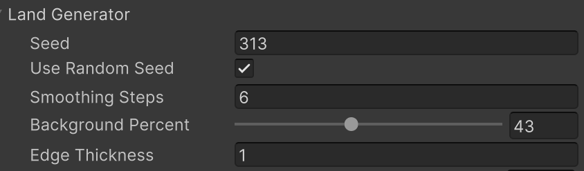
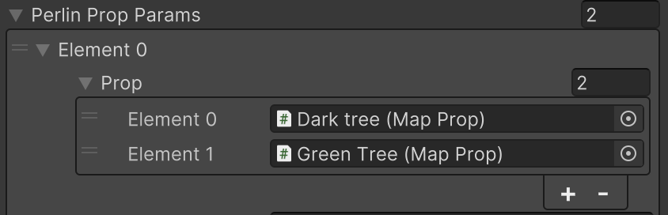
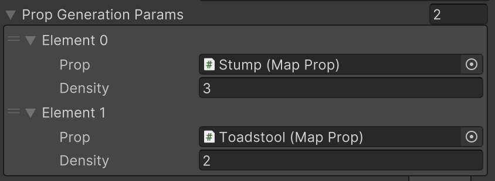
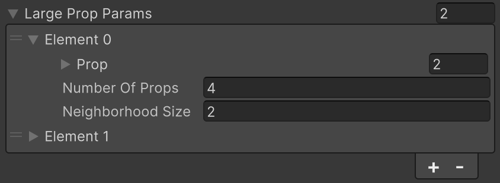

# Procedural Map Generation

For this project, I prepared some procedural 2D world generation. In order to get a realistic effect and make it customizable I used a couple of different algorithms for different types of props.

### 1. Land Generator (Cellular Automata)
Land is generated with the use of the Cellular Automata algorithm, which essentially generates a random grid of water and land. After that smoothing is applied, which overwrites some cells with water or land to better match its neighbors, resulting in island-/lake-like shapes.

You can either use a random seed or stick to one of your choice, e.g., if you like the shape of the land, but would like to regenerate map props, you can just save the seed you like.
You can also adjust how much of the space you want to be occupied by water. The percent refers to the state before smoothing though, so you might want to try different combinations of this parameter and the number of smoothing steps. 
Edge thickness refers to the number of cells that will be water on each of the four edges of the map. Setting it as 0 will allow land to be generated on the edges, setting more will put water in those places.

### 2. Trees and Flowers (Perlin Noise)

Trees and flowers are generated on a basis of a Perlin Noise map, which is combined with the land map so that they only generate on land.

You can choose density for each prop (my favorite results generate around 0.3-0.5 density) and a modifier. The modifier is not like the seed in the CA algorithm and will not return the same shape every time, because each generated map of props based on perlin uses random offsets (to make the shapes slightly more natural-looking).
The first element (type of prop) will have priority in generation over the latter ones, but they can be rearranged freely. More perlin-based objects can be easily added and adjusted.

### 3. Mushrooms and Stumps (Random Extra Props)

Mushrooms and stumps are generated in the simplest way, the algorithm considers every cell in the grid separately, and if it's land without any other prop it either generates or does not generate a new prop there.

The density can be adjusted. Increasing it increases a chance of generation on a free land cell. For natural looking effects with only a couple of mushrooms and stumps on a map, I usually set the density at 2 or 3.
New props can be easily added.

### 4. Tents and Fireplaces (Random Placement of a Given Number)

The desired number of Tents with fireplaces is placed in a random free spot on the land.

You can adjust the number of props that will be spawned. These are referred to as large props because they take up more than one tile. Because of that before they are generated on the grid, the algorithm checks whether there are already props on the neighbouring tiles.
The size of the neighborhood refers to the number of cells that have to be free around the given cell for the prop to be generated. If set to 1, there has to be 1 cell free in every direction - this means that the large prop can safely take up 9 tiles. If set to 2, it will be 2 free tiles in every direction, so the large prop can safely take up 25 tiles, and so on.